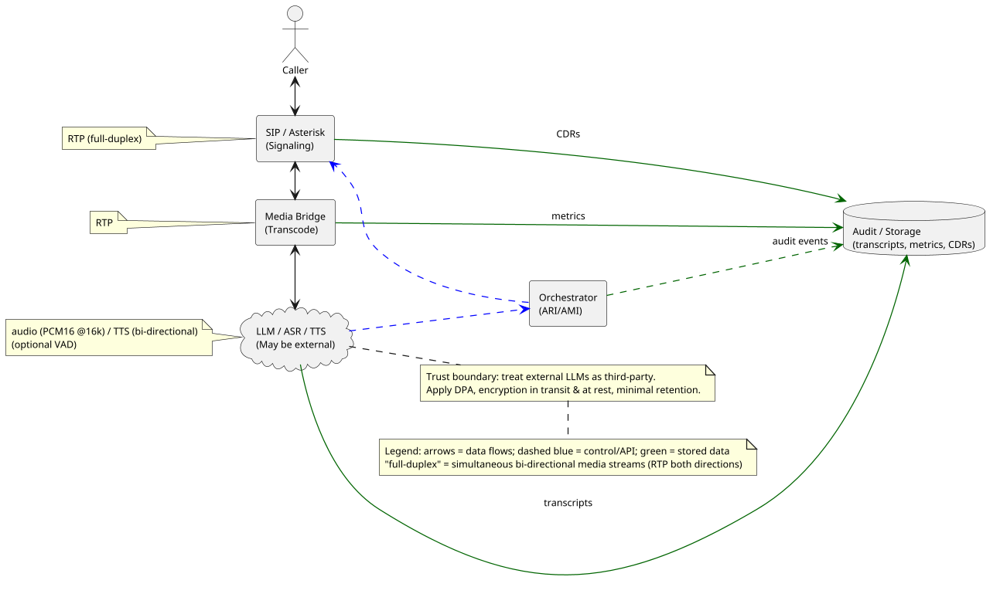

# Systemarchitektur – Übersicht (PlantUML)

Die folgende PlantUML-Datei beschreibt die Systemarchitektur des Projekts und visualisiert die zentralen Komponenten und Datenflüsse:

**Hinweis:**
- Die Datei `diagrams/llm_dataflow_overview.puml` im Repository enthält diese Architektur als PlantUML-Quelltext.
- Für eine grafische Darstellung kann die Datei mit einem PlantUML-Renderer (z.B. VSCode-Plugin, Online-Renderer) als Diagramm exportiert werden.
